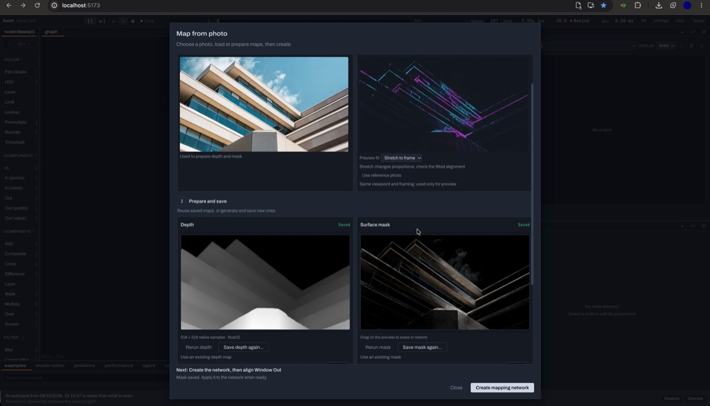

<p align="center">
  
</p>

<h1 align="center">Loom</h1>

<p align="center">
  A browser-based WebGPU node compositor.<br>
  <a href="https://laubsauger.github.io/loom/">Open Loom</a>
</p>

Build visuals with nodes, WGSL shaders and GPU point kernels. Drive parameters with
audio, MIDI, OSC or expressions, then export stills and MP4s or send the result to a
projector. Save your work as a `.loom.json` project and reuse parts as components.

<a href="./docs/loom-editor.png">
  
</a>

## What you can build

- Video effects with feedback loops, frame caches, depth and pose inference.
- Custom WGSL shaders with typed controls generated from `struct Params`.
- GPU point systems rendered as points, instances or meshes.
- 3D scenes with cameras, lights, shadows and materials.
- Audio-reactive visuals and controller-driven compositions.
- Reusable components, multiple output views and saved workspace layouts.

Browse the [examples](./examples/README.md) for working networks. Loom's core GPU
runtime uses [vGPU](https://vgpu.sh/) by Vercel Labs.

## Run locally

Requires Node.js 22.12+, pnpm 9.15.4 and a browser with WebGPU.

```bash
pnpm install
pnpm dev
```

The [hosted app](https://laubsauger.github.io/loom/) runs browser features.
Local device connections, terminal panes and desktop MCP clients need a local clone
and the helper below.

For the Electron app, run `pnpm desktop:dev`. macOS Apple Silicon supports Syphon
and NDI; native setup requires Xcode, and NDI needs a separately supplied SDK.
Windows Spout transport is not implemented. See the [desktop guide](./src/desktop/README.md).

## Photo projection mapping

Choose **File → Map from photo…**. Prepare or reuse float32 depth and an optional
surface mask, preview animated effects on the reference photo or a night shot, then
create an editable mapping network. Align projector output with Grid Warp and Corner Pin.



[Photo mapping guide](./docs/photo-mapping.md)

## Connect devices

Run the helper and enter its pairing code under **agent → Connections** in your local
Loom tab. MIDI works directly through the browser; OSC, lasers and native Person Mask
use the helper.

| Command | Enables |
| --- | --- |
| `pnpm helper` | Device connections and the MCP server |
| `pnpm helper --terminal` | Terminal panes running a local shell |
| `pnpm helper --grant-export` | Agent access to rendered pixels and readbacks |
| `pnpm helper --all` | Device, terminal and pixel access |
| `pnpm helper --devices-only` | Device connections without the MCP server |
| `pnpm helper --phone` | A phone control panel on your local network |

Shell and pixel access require their flags when you start the helper. Phone access
is separate from `--all`.

[Helper, MIDI and OSC setup](./docs/connections.md)

## Work with an agent

MCP lets a desktop agent edit networks, shaders and parameters. WebMCP exposes the
same tools to supported browser agents. Changes appear in the editor and remain
undoable; connect MCP to your local tab to work on the visible project.

[Agent setup](./docs/agents.md)

## Development

The app uses TypeScript, React, CSS Modules and a WebGPU runtime. See the
[spec](./SPEC.md) for the architecture and project format.

Build with `pnpm build`. Run `pnpm lint`, `pnpm typecheck` and tests for the affected
feature before submitting changes. Maintainers publish the hosted build from `main`
with `pnpm deploy`.
