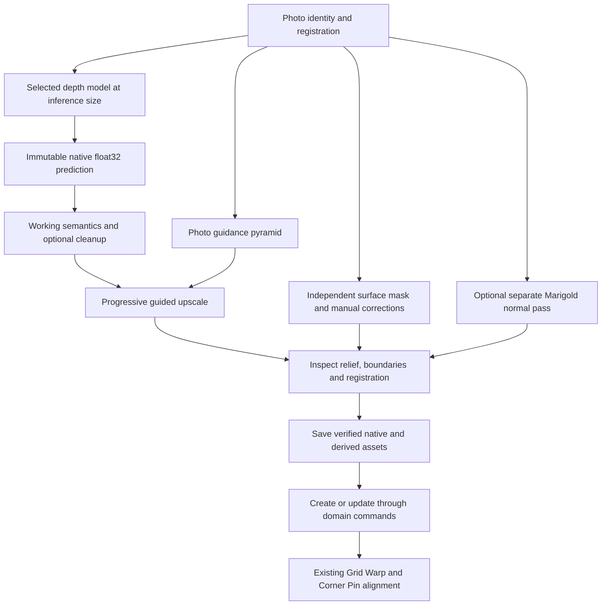

# Photo mapping: model choice, guided refinement and quantized Marigold V2

Status: DAV2 model choice, recipe compatibility, guided refinement, inspection UI, artifact
names and quantized Marigold V2 depth on desktop MLX are implemented (2026-10-09).
Separate normals and additional alignment/relief tools remain planned. The sections below
retain their full scope; they do not claim every later feature is shipped. See
[DAV2/refinement evidence](models/photo-depth-verification-2026-10-09.md) and
[36 GiB native proof](models/marigold-v2-mlx-verification-2026-10-09.md).

The target machine is an Apple M3 Mac with **36 GB unified memory**. Processing stays
local. Quantized Marigold V2 passed 512/768/1024/1280/1536, including square inputs, through the native
Swift/MLX worker. Longer preparation is acceptable. Browser users can reuse these saved
assets without native inference; normal/relief views and further gizmos remain planned.

## Outcome and boundaries

Extend **Map from photo** with DAV2 Large beside existing Small, a reproducible sequence of preparation passes, RGB-guided depth upscaling, optional Marigold V2 depth and normals, and a larger inspection workspace. Keep a single reference photo, separately prepared coverage and the ordinary editable mapping network.

Preparation remains explicit. Choosing a photo/model/size never starts a download or inference. Rendering, reopening and exporting a saved network use prepared assets without installing its preparation models. Model inference and refinement run outside the frame loop. Existing live video Depth behavior remains independent.

Every item in the supplied guide is accounted for below, including the parts that need correction. No cloud processing, silent model substitution, automatic CPU retry, hidden reduction of resolution, or fabricated successful maps. Photogrammetry is excluded by the single-image requirement. Metric reconstruction and exact automatic projector calibration cannot be promised from relative monocular predictions.

## What already exists

| Responsibility | Existing seam | Required change |
| --- | --- | --- |
| Product contract | [SPEC.md, photo preparation](../SPEC.md#photo-preparation-for-projection-mapping) | Add planned extension separately from shipping contract. |
| Explicit preparation | [photo-preparation.ts](../src/app/photo-preparation.ts) | Replace positional arguments with a typed recipe; currently hardcodes Small FP32 and WASM. |
| Acquisition and cache | [model-acquisition.ts](../src/runtime/models/model-acquisition.ts), [cache-model-store.ts](../src/runtime/models/cache-model-store.ts) | Reuse consent, measured progress, verified complete writes; handle large native bundles without accumulating all shards in RAM. Current browser cache is Cache API, not IndexedDB. |
| One-shot inference | [worker-runner.ts](../src/runtime/models/worker-runner.ts), [inference-worker-core.ts](../src/runtime/models/inference-worker-core.ts), [model-signatures.ts](../src/runtime/models/model-signatures.ts) | Add inspected Large signatures and packing; keep live runners simple. Preparation owns multi-stage orchestration. |
| Numerical persistence | [float-map.ts](../src/runtime/media/float-map.ts), [prepared-map.ts](../src/runtime/media/prepared-map.ts) | Use ordinary FLOAT32 OpenEXR with source/recipe/parent metadata; preserve native samples exactly. |
| Registration and sizes | [preparation-sizes.ts](../src/domain/media/preparation-sizes.ts) | Model-specific input dimensions; distinguish inference, native prediction, refined asset and graph output sizes. |
| Creation/update | [photo-mapping-commands.ts](../src/domain/commands/photo-mapping-commands.ts), [photo-mapping-host.tsx](../src/app/photo-mapping-host.tsx) | Recipe-aware staleness and atomic application through commands. No second graph mutation path. |
| Map loading/export | [use-float-map-sources.ts](../src/app/use-float-map-sources.ts), [float-map-in.ts](../src/nodes/definitions/float-map-in.ts) | Read semantics and provenance v2; remove universal DAV2-side assumptions without rewriting old parameters. |
| Capability UI | [requirements.ts](../src/domain/types/requirements.ts), [host-shell.ts](../src/devices/host-shell.ts), [TypeBadge](../src/ui/primitives/node-identity.tsx) | Reuse canonical badges and unknown/unmet/met states on preparation choices and Run. |
| Mapping handles | [use-viewer-mapping.ts](../src/app/use-viewer-mapping.ts) | Reuse Corner Pin/Grid Warp controls after creation, including grouped undo. |

Readiness now compares the full inference or refinement recipe, with dependency-specific invalidation. Preparation metadata is strict and versioned; extensions need a deliberate schema change. Existing native Vision is a specialized Apple Vision/XPC/IOSurface mask transport, not a Torch or MLX model runner.

## Verified model facts and release choices

### DAV2 Small and Large

Keep existing Small FP32 and Small Q4F16 identities unchanged. Expose both in photo preparation using the same artifact descriptors already used by the live node. Keep the existing default until facade comparisons justify changing it.

Large has published ONNX variants. Use these before considering an export toolchain. Metadata was read from the [publisher API](https://huggingface.co/api/models/onnx-community/depth-anything-v2-large?blobs=true) on 2026-10-09; these are artifact facts, **not execution benchmarks**. Revision: `1fa1591c7b080e98da9655827c3a33a3972a4a83`.

| Candidate | File under `onnx/` | Exact bytes | SHA-256 |
| --- | --- | ---: | --- |
| Large FP32 reference | `model.onnx` | 1,336,922,232 | `a93aa89b5e92e30e0afbe0f7c3ec692b35cfca791ae9004a190fb0ca2010e905` |
| Large FP16 | `model_fp16.onnx` | 668,656,405 | `8eefc7afb877b10d413c8e1024b012073c6e4f62735d39555b1083fee3aabf0a` |
| Large Q4F16 | `model_q4f16.onnx` | 234,560,369 | `8d180bf55d92bdae8c1a15ea3f13ad18f4e7d2721037779f0ddd7b6dbe92fad8` |
| Large INT8 comparison | `model_int8.onnx` | 347,424,978 | `69d98c2c39ade5a86dcbbcf2f18b69b8c0b72a141cd2058febe0c1349a83bb9d` |

First candidates for the chooser: FP16 and Q4F16, subject to real execution and quality checks. Use FP32 as the comparison reference; add INT8 only if measured results warrant another user option. Quantization is an artifact choice, not a claim of faster execution. Labels show full model name, precision and size derived from exact bytes in Loom's existing size convention. [Published artifact inventory](https://huggingface.co/onnx-community/depth-anything-v2-large/tree/main/onnx).

Small weights are Apache-2.0; Large weights are labeled CC-BY-NC-4.0. Preserve the actual notice and resolve suitability for commercial projection workflows before enabling Large in a public release. Quantization does not change the source license. [Author's license statement](https://github.com/DepthAnything/Depth-Anything-V2#license).

### Marigold V2 is a separate pipeline

Actual V2 uses a Qwen diffusion transformer, VAE, task checkpoint and precomputed prompt embeddings. The upstream quick start targets Linux/CUDA and reports approximately 17 GB GPU memory at 1024² and 29 GB at 2048². Its default depth is affine-invariant **log depth**, not DAV2 inverse depth; normals use a separate task checkpoint. [Upstream implementation](https://github.com/huawei-bayerlab/marigold-v2).

The [Qwen base card](https://huggingface.co/Qwen/Qwen-Image-Edit-2509) lists 20B parameters. Arithmetic weight floors are about 10 GB at 4-bit and 20 GB at 8-bit, before scales, unquantized layers, VAE, task weights or activations. The supplied 1.5–3.5 GB total download claim is unsuitable for planning. Measure the complete selected bundle and conversion peak; a small adapter is not the whole model.

V2 performs one transformer step. Its graph still has multiple stages: input packing, VAE encode/sample, latent preparation, conditioned transformer, flow update, VAE decode and task decoding. Do not expose a fictitious 10–50 denoising-step control for V2. Record the seed and preserve the reference timestep/dtype behavior. [Inference configuration](https://github.com/huawei-bayerlab/marigold-v2/blob/main/evaluation/config/inference_depth.yaml), [reference graph](https://github.com/huawei-bayerlab/marigold-v2/blob/main/marigoldv2/experiments/20260316_qwen_depth/network_graph.py).

The older SD-based `prs-eth/marigold-depth-v1-1` in the conversation is a different model. It must never appear as V2 or be selected after a failed V2 run. It is not a substitute in this plan. [V1.1 model card](https://huggingface.co/prs-eth/marigold-depth-v1-1).

## Host support policy

| Preparation choice | Browser | Electron on the 36 GB M3 | Helper |
| --- | --- | --- | --- |
| Existing Small | Existing WASM route remains; WebGPU is a separately verified choice. | Same web route unless native execution is explicitly selected. | Not required. |
| Large FP16/Q4F16 | Implemented verified WebGPU sizes; Large WASM is limited to 266/518. | Reuse verified web execution. If web proof identifies a blocker, evaluate an explicitly selected native ONNX/Core ML executor. | Not required for browser inference, desktop-owned inference or CORS-readable acquisition. |
| RGB-guided refinement/upscale | Implemented progressive float32 WebGPU passes with GPU proof. | Same backend passes. | Not required. |
| Quantized Marigold V2 | No validated browser export currently established. Keep unavailable with reason. | Implemented Swift/MLX mixed Q4/Q8 depth; verified through 1536 on 36 GiB M3 Max. | Not required when Electron directly owns the worker. |
| Saved mapping network | Loads numerical assets and renders normally. | Loads the same assets. | Preparation requirements do not carry onto saved maps. Device output requirements still apply normally. |

Attach requirements to the **selected preparation executor**, not the model name alone. A native Mac MLX executor declares `desktop`, `macos`, `apple-silicon`. A future explicitly implemented browser-to-helper executor declares `helper` plus its platform constraints. Declare both `desktop` and `helper` only if a route actually needs both. Do not advertise a helper execution route before one exists.

Use canonical **Device helper**, **Desktop only**, platform badges and muted **Not implemented** styling. Model availability also needs an independent execution verdict: unknown/probing, supported, missing runtime, unsupported kernel, insufficient measured budget, failed. Electron presence, a paired device helper or an Apple adapter string does not prove a model can run.

Keep canonical labels, but generalize their shared descriptions where currently tied to one feature: `apple-silicon` currently mentions the Python Vision worker, while `helper`/`desktop` mention sockets/transports. Those descriptions must accurately cover preparation as well. Put model/runtime-specific prerequisites beside the selected executor, not in the universal platform badge.

Unsupported choices remain discoverable with the specific reason and relevant action. No automatic backend/model/size replacement. A failed pinned execution reports its failure and lets the operator deliberately select another supported configuration. Existing acquisition/download routes can require helper independently of inference; show that distinction when relevant.

## Later macOS phase: quantized V2 on 36 GB

Investigate [the MLX Swift V2 port](https://github.com/mnmly/mlx-swift-marigold-v2) first. It reports an Apple Silicon implementation and parity checks, but currently runs an unquantized base, recommends 64 GB minimum and leaves quantized bases on its roadmap. Treat it as source to audit, not a ready 36 GB dependency. Pin an audited revision and dependency lock; verify the claimed parity locally.

1. **Audit and choose the narrow route.** Inspect that port's transformer, VAE, task decoding, checkpoint switching and license notices. Prefer adapting a working inference implementation over building the model from scratch. Keep Swift MLX and Python MLX as candidates; use one production executor after evidence selects it.
2. **Quantize without losing task semantics.** Start with 4-bit transformer matrices and mixed precision for sensitive layers, VAE and adapters. Test 8-bit only as a reference/alternative if it fits. The upstream checkpoint is trained with a bitsandbytes-quantized base; MLX affine quantization is not automatically equivalent to NF4. Compare quantize-base-plus-adapter versus merge-then-quantize. Audit modules excluded from quantization and modality-specific decoder weights. [Upstream component loader](https://github.com/huawei-bayerlab/marigold-v2/blob/main/marigoldv2/experiments/20260316_qwen_depth/component_loader.py), [MLX quantized matrix API](https://ml-explore.github.io/mlx/build/html/python/_autosummary/mlx.core.quantized_matmul.html).
3. **Avoid requiring an unquantized fit on this Mac.** Use shard/layer-at-a-time conversion or obtain an audited prequantized bundle. Conversion must not require loading the full 20B BF16 model in 36 GB. Quantized weight files are the distributed/cacheable artifacts; runtime quantization of a full base defeats the memory requirement. Verify artifact hashes and model provenance.
4. **Establish stage parity.** Compare fixed source pixels and fixed VAE noise against stored trusted reference tensors. Check VAE moments, packing, position encoding, transformer velocity, flow update, decoder and final depth. RNG seeds alone do not imply cross-runtime identical noise; retain fixed-noise fixtures. Measure differences before and after affine alignment and inspect facade edges.
5. **Measure the user's machine.** Start at a 512-pixel long edge, then 768 and 1024, rounded to the validated 16-pixel grid with recorded padding. Test 4-bit first. Record exact M3 model, 36 GB memory, macOS, runtime revisions, cold/warm duration, conversion/load peak, prediction peak, swap/memory pressure and concurrent Loom rendering. 1536/2048 remain disabled until independent proof fits.
6. **Budget total memory.** Initial engineering target: worker peak at most 20 GB, leaving roughly 16 GB for macOS, Loom and other active work. This is a proposed budget, not a measurement or allocator guarantee. Measure the combined session; OS pressure or sustained swap fails acceptance even if the worker stays below its nominal cap. Load one large backend at a time; release DAV2 weights before V2. Serialize depth/normal jobs. Do not hide lower size or CPU execution after an allocation failure.
7. **Alternative evidence.** PyTorch MPS with an explicitly supported quantized implementation is the next candidate if the MLX route fails a named invariant. Native Core ML/ONNX conversion is a later candidate only with task parity and operator coverage. These are deliberate engineering alternatives, not runtime retries. [MPS documentation](https://docs.pytorch.org/docs/stable/notes/mps.html), [Core ML provider documentation](https://onnxruntime.ai/docs/execution-providers/CoreML-ExecutionProvider.html).
8. **Publish a capability report.** Record supported bit-depth/task/size combinations, full download/disk requirements and failure reasons. A working 512/768 route is useful even when slower. Larger refined output does not require larger model inference. No claim that all M3 machines or 8-bit configurations fit.

Stop this phase with either a proven quantized local V2 configuration on the 36 GB M3 or a precise unresolved kernel/parity/memory blocker and the next experiment. An unquantized 64 GB demonstration does not complete it.

## Ordered preparation recipe



### 1. Input and inference

Hash original photo bytes and record decoded orientation, dimensions, framing and exact registration. Preserve the original asset. Canvas handles the colour photo only. Follow each inspected artifact's colour normalization/layout; do not route numerical outputs through canvas or image encoding.

For DAV2, initially evaluate existing sides 266, 392, 518, 644, 770, 896, 1036, 1288 against each Large artifact. Only publish verified combinations. Marigold uses its own rectangular dimensions and 16-pixel alignment; the DAV2 multiple-of-14 list must not validate it. The upstream CLI resizes its saved output back to source dimensions; capture prediction **before** that resize to preserve native provenance. [Output writer](https://github.com/huawei-bayerlab/marigold-v2/blob/main/marigoldv2/validation/folder_steps.py).

Save native depth values untouched, with exact model/bundle identity and raw prediction semantics. Convert only the working branch to Loom's near-bright relative relief convention. DAV2 inverse depth, Marigold log depth and other supported parameterizations need explicit named transforms. Reversing log depth for display is not metric conversion. Do not blend different models' raw values or assume they share scale.

### 2. Optional cleanup and progressive guided upscale

Separate **Inference size** from **Refined output**: native, source-sized, 2K or 4K long edge, preserving aspect and obeying source/project/device limits. Show exact resolved dimensions before Run. Do not silently clamp a requested target. A 4K result is an RGB-guided derived map, not a native 4K model prediction or recovered measured geometry.

Use a bounded joint bilateral upsampling pass with the high-resolution photo as guidance. First establish registered float32 resampling; then evaluate progressive at-most-2× stages and a bounded final cleanup against a single direct upscale. Record scale sequence, algorithm version, radius and colour/spatial sigma in the recipe. The pass must preserve broad relief while suppressing noise within surfaces. Controls expose edge sensitivity and smoothing with numerical expert fields, an Off option and live inspection of the derived result.

RGB edges may be shadows, paint, seams or reflections rather than geometry. Compare raw/refined edges and planar stability; never describe the filter as perfectly snapping to physical structure. Do not inject photo texture as depth detail. Optional additional inference/tile passes require their own demonstrated benefit, registration, scale alignment and seam tests; the requested extra passes are first satisfied by explicit pyramid/refinement/normal stages, not speculative crop-model fusion.

Implementation belongs behind `src/runtime/backend`; shared math and recipe validation remain DOM-free. WGSL uses `r32float` storage with the real format name, explicit bounds, uniform alignment, positive finite sigmas and texel-centre coordinates `(pixel + 0.5) / extent`. Do not assume `r32float` filtering is available: use supported unfilterable bindings and explicit bilinear loads when needed. The supplied shader's `r32` spelling is invalid, its uniform layout needs attention, and `select` does not protect an invalid division. With finite guidance, positive sigmas and an included centre sample, the denominator has a positive centre weight; violated invariants fail preparation explicitly. Border treatment must match the reference implementation.

Avoid a large square-neighborhood kernel directly over every 4K pixel. Bound radius and stage count, assess tiled workgroups/pyramids, and measure actual GPU memory, dispatch time and readback. Persist float32 derived samples. Any float16 working optimization requires an explicit precision comparison and must not replace native storage.

### 3. Surface normals and coverage

V2 depth and normals are separate task runs. Reuse an audited shared base where supported, but swap the complete task state: adapter, any trained decoder and prompt embeddings. Verify depth → normals → depth round-trip equivalence; no cross-task residue. Release task buffers and serialize sessions within the memory budget. Do not infer that depth already contains a normal map.

Keep normals numerical, camera-space signed XYZ with validated direction, orientation, length and registration. For the first integration, store three grouped scalar `.loom.exr` assets (X/Y/Z), with v2 metadata identifying component and common group/recipe identity. Reuse scalar Float Map In loading and an editable Custom WGSL packing/consumer branch. Add an explicit validated normal-component interpretation and v2 metadata kind; current Raw loading bypasses photo preparation checks and is insufficient for this group. Verify all three component identities, photo hashes, dimensions, registration and recipe/group identity before packing or export. Missing/mixed components, partial save, cancellation and partial relink leave the group incomplete; no normal result becomes ready until all references are verified. Preserve original normal samples; normalize a working copy after any resampling. Use explicit OpenEXR channel/group metadata without inventing a numerical container.

Normal-based angle exclusions are an optional **suggested mask layer** with a threshold, overlay and explicit Accept. They do not prove physical occlusion: the projector direction/calibration can be uncertain, and hidden geometry is unavailable. Preserve the existing TopFormer/BiRefNet/manual mask as independent coverage. A changed depth or normal run never destroys its brush corrections. Existing mask rerun keeps its explicit replace-edits semantics.

### 4. Relief preview, alignment and network output

Add a modest 2.5D relief inspection mode using existing geometry/displacement nodes where they fit. Label depth exaggeration and assumed camera settings; provide reset-to-photo viewpoint. This is a diagnostic for wrinkles, noise and recesses, not a metric reconstruction. Keep the primary result the existing image-space mapping network and projector branch. Optional normal inputs append after current depth/mask inputs; their indices and component order are explicit.

Offer four-point assisted **planar** alignment by reusing Corner Pin plus numbered source/target handles, magnification and reprojection feedback. Four correspondences alone do not establish exact projector intrinsics/extrinsics from affine depth. True PnP needs calibrated intrinsics and valid 3D-to-2D correspondences; it remains a separate calibrated-geometry feature. Do not add OpenCV.js for an unsupported exact-calibration promise. [OpenCV PnP contract](https://docs.opencv.org/4.x/d5/d1f/calib3d_solvePnP.html).

## Recipe, assets and job ownership

Introduce a versioned `PhotoPreparationRecipe` in the domain media layer. It records source identity/registration, artifact identities, precision, executor revision, model-specific input dimensions, depth convention, seed, requested passes and derived output dimensions/settings. Resolved execution records include actual backend and full ordered stage identities. Distinguish requested configuration from completed provenance.

Preparation metadata v2 records native dimensions, parameterization, recipe digest, stage/parent content identities and output registration. Strictly read v1 as legacy DAV2 inverse-relative depth or existing mask behavior; do not reinterpret its samples. Canonical artifacts are ordinary FLOAT32 OpenEXR files with Loom metadata; the proprietary container and its reader were removed at the owner’s request. Do not rewrite files on load. Native and refined depth remain separate durable identities; export and graph creation choose the inspected final map explicitly.

Parent hashes alone cannot reopen the preserved native asset. Retain its external `AssetReference` through a typed binary asset parameter on the final prepared Float Map In, alongside the final map reference; the existing graph asset inventory then collects both. Keep any additional required parent references in similarly declared asset fields, not opaque URLs inside arbitrary recipe JSON. A missing native parent offers the ordinary relink flow and disables dependent refinement/rerun reuse, but a valid saved final map still renders without it. Reopening must make the retained native map inspectable bit-for-bit without inference.

Persist the recipe with prepared assets and restore it in Prepare/rerun. Extend the node schema through the existing model-dependent parameter mechanism where appropriate; keep old `inputSide` values recognized during migration. Update reload recipes, graph creation input validation and source readiness together. Change source/model/revision/precision/seed/size/refinement and only dependent stages become out of date. Unchanged upstream results can be reused only by verified identity. A saved map's original executor need not be installed to render it.

One preparation session owns its plan, worker, stage outputs and cancellation token. States: idle, validating, acquiring, loading, processing, refining, saving, complete, cancelled, failed. Progress is per real stage; show bytes or completed dispatches where counted, otherwise elapsed time and indeterminate status. No invented inference percentage. Check cancellation between VAE/transformer/decode/refinement stages; GPU work already submitted may finish, but its result must not publish after cancellation. Close, source replacement and renderer exit retire owned jobs and temporary assets.

Last successfully saved/applied maps remain active until new results are saved and applied. Failure/cancellation preserves maps, mask history and calibration. Failed saving never marks a stage durable. Creation/application still uses one undoable command transaction with target revision checks.

For native preparation, add a narrowly typed preparation bridge under `src/devices`, native executor code under `src/devices/native` and ownership/IPC adapters in `src/desktop`. V2 is the required native integration; native Large uses the same job contract only if web proof establishes that need. Operations cover capability probing, approved bundle acquisition, start, progress, cancel and close. Requests use validated recipe/model IDs and bounded binary payloads or owned file handles. No arbitrary executable/path or shell-command API. Keep `src/devices` independent of MCP. Reuse main-frame authorization and renderer-exit cleanup patterns from native Vision without routing static artifacts through its live IOSurface leases.

The desktop-owned runner declares Desktop only; launching a native child does not inherently require the device helper. Do not add another helper process or change its existing two-door architecture. Browser helper execution is a separate future route only if needed and implemented.

Browser DAV2 acquisition keeps Loom's Cache API, hash checks, consent and progress. Native V2 stores shared base shards once on disk and verifies task bundles separately. Check free disk space, show total base/task bytes and support explicit cache management. Partial downloads/conversions are incomplete artifacts, never cache hits. Publish only fully verified bundles; resumable downloads verify the resumed final object. Avoid cloning a complete multi-gigabyte buffer over IPC or accumulating all shards in JS memory. Cached processing must work with network disconnected. Browser/desktop caches may have different origins/ownership; disclose that instead of promising one universal cache.

## UI specification

Use Loom's Radix controls, CSS variables and CSS Modules. No Tailwind, no invented component library, no implementation details in the primary operator flow. Preserve File/Output entry points and Prepare/rerun on existing map nodes.

The dialog becomes a resizable preparation workspace with one large shared viewport, a compact step rail and contextual controls. Avoid two small competing canvases. On narrow windows, switch between Preview and Controls while retaining current stage, zoom and selection.

```text
Map from photo                         Local processing       Close
Photo  /  Depth  /  Refine  /  Surface  /  Review
┌────────────────────────────────────────┬──────────────────────────┐
│ Photo | Native depth | Refined | Mask  │ Model                    │
│ Normals* | Relief                      │ Name · precision · size  │
│                                       │ Canonical requirement tags│
│       Shared pan/zoom viewport         │ Execution availability   │
│       Before/after divider             │ Inference size           │
│       Brush/corner magnifier           │ Refined output           │
│                                       │ Stage controls           │
│  Fit   100%   Compare   Sample value   │ Advanced settings        │
├────────────────────────────────────────┴──────────────────────────┤
│ Stage status · elapsed · measured progress     Run / Cancel        │
│ Native size · refined size · float32           Save & create       │
└───────────────────────────────────────────────────────────────────┘
* Visible when a normal stage is selected or loaded.
```

- **Model choice:** explicit Small/Large/V2, precision and measured download size; cached state and complete native bundle cost. For unavailable V2 on this host, show the precise missing executor/memory validation and disable Run for that choice. Keep advanced backend controls explicit.
- **Preparation choices:** Raw depth and Facade refinement explain the enabled passes. Presets reveal their model/size/settings; they do not conceal model selection or trigger inference. Preserve already loaded native maps so Refine can run without inference.
- **Inspection:** synchronized pan/zoom, fit and true 100% sampling view; before/after wipe comparing native-resampled and refined depth; scalar hover readout, one pinned sample and compact line profile. Display normalized visualization separately from raw stored value.
- **Useful gizmos:** brush-radius cursor and local magnifier for opening edges; brush erase/restore with undo; numbered alignment handles and corner magnifier. Share registration across views so a roofline remains under the same cursor. Disable conflicting brush/warp/orbit tools by selecting one tool, not overlapping gestures.
- **Stage rail:** native/refined/normal/mask states are visible and selectable. Edits mark dependent stages Out of date. A clear next action replaces repeated explanatory paragraphs. Independent Run/Rerun remains available; Run selected steps executes the visible plan only after an explicit click.
- **Progress:** stage name, pass index when real, elapsed time, acquisition bytes and Cancel. Do not keep a timer running after completion/close. Reduced motion removes decorative movement; stage/error announcements remain available.
- **Surface:** retain optional full-frame coverage, facade cutoff/glass choices, manual corrections and low-coverage warnings. Show angle-based exclusions as a distinct suggestion layer. Accepting a suggestion remains undoable and never silently rewrites the mask.
- **Review and finish:** show source, native prediction, refined asset and graph output dimensions separately; show prepared/saved/out-of-date states. Saving and creation require verified maps. Imported assets enable review/create without a model runtime. Preview photo brightness/opacity/framing retain their existing effect-independent behavior.
- **Accessibility:** keyboard-operable tabs, stage list, compare divider, zoom and numbered handles; numerical handle fields; visible focus and labels; Escape behavior; no colour-only availability/error signals. Keep viewport geometry stable while long jobs update status. Use existing mapping shortcuts and undo grouping.

## Guide coverage and corrections

| Supplied guide item | Plan treatment |
| --- | --- |
| DAV2 Large export and INT4/INT8 conversion | Start with inspected published ONNX artifacts; compare FP16/Q4F16, retain FP32 reference. Proposed export/quantization module commands are unverified and must not be copied into tooling. |
| Marigold single ONNX/ORT export | No validated export established. Native quantized MLX/MPS feasibility comes first on 36 GB M3; future web export requires all stages and parity, not a fake RGB-in/depth-out session. |
| Session hot swap | Reuse verified identities and retire prior sessions; task changes include adapter, decoder and prompt. Measure shared-base lifecycle and cancel/exit cleanup. |
| Apple acceleration and thread settings | Choose tested provider/worker settings using existing runtime policy; do not equate browser WebGPU with Neural Engine or set all hardware threads blindly. |
| `preferredOutputChannels` and first tensor selection | Use artifact signatures, explicit output names and dtype conversion. The guide's generic session options/output order are not an API contract. |
| Raw float depth and 16-bit/r32 textures | Native and saved output stay float32. Working GPU precision is independently verified; scalar depth has no sRGB decode. |
| Bilateral structural upscale | Registered bounded progressive WGSL passes, numerical controls, honest raw/refined inspection and measured quality/performance. |
| LoRA depth and normals | Separate task inference, complete task-state switching and signed numerical normal assets. |
| IndexedDB caching | Reuse actual Cache API for browser models; native sharded disk cache for large V2 bundles. No duplicate database from sample code. |
| HTTP headers/compression | Preserve app COOP/COEP; check CORS/CORP for model origins. Compression headers describe actually encoded bytes, not a switch that makes raw files compressed. Check browser isolation rather than adding a second deployment configuration. |
| Mesh/vertex output | Optional relative-relief diagnostic/branch using existing nodes; saved image-space mapping remains primary. |
| Four clicks/PnP | Assisted planar Corner Pin is valid. Exact projector pose requires calibrated geometry/intrinsics and is outside this single-relative-photo result. |
| Static anchor/live depth blending | Keep static prepared mapping separate from existing live Depth. No new live fusion mode in this preparation extension. |
| Claimed M3 timings, footprint and flawless geometry | Replace with measurements on the actual 36 GB M3; no guarantee of perfect facade recovery or faster quantized inference. |

## Implementation order and completion gates

1. **DAV2 artifact proof.** Acquire candidates explicitly, inspect real IO/operators and run representative facade crops/full frames at a few sizes on browser WebGPU and deliberately selected WASM. Record output direction/registration, cold/warm times and memory. Determine release license handling. No catalogue option ships on metadata alone.
2. **Recipe and compatibility foundation.** Add v2 preparation metadata/identity with v1 read preservation, cancellation and dependent-stage states. Update creation, reload, inspector and loader together. Prove Small/native behavior before adding derived maps.
3. **DAV2 Large end-to-end.** Add verified descriptors/signatures, provider/size capability reporting, model chooser and independent save/reopen/rerun. If browser proof identifies an operator/memory blocker, evaluate native ONNX/Core ML and implement a deliberately selected desktop executor with the appropriate badges; this is not an automatic retry after a failed web run. Stop with real Large inference on a proven browser or desktop executor, followed by saving and reopening the map in the normal browser network without inference. No change to existing live Depth identities.
4. **Guided refinement and UI workspace.** Implement registered float32 pyramid/upscale stages, preview comparison, sampling/profile tools, stage controls and existing mask/alignment gizmo reuse. Prove improvement on facade fixtures without invented relief. Verify 2K/4K budgets on the user's machine.
5. **Later quantized macOS V2 feasibility.** Audit the MLX port and build/convert a 4-bit candidate with fixed-noise reference checks. Test 512/768/1024 within total 36 GB memory. Produce capability/memory/download evidence. This milestone requires quantized execution; a 64 GB-only path does not pass.
6. **Native V2 integration and normals.** Once phase 5 passes, integrate the one selected executor, canonical requirement UI, bundle acquisition, stage progress, cancellation, task switching and normal suggestions. Save derived output and reopen/render it in browser with no native runner.
7. **Release proof/documentation.** Update user help/model notices, verify accessible UI and actual saved graph/effect preview, run scoped gates and report unsupported configurations explicitly. Do not deploy or alter Git history.

Acceptance fixtures include head-on repetitive windows, cornices, deep portals, glass, blue paint, strong shadows and a low-contrast flat wall. Compare model/precision at matched inputs and compare interpolation/guided refinement at matched outputs. Inspect relief and edge position, not merely sharper grayscale images. Quantization must not introduce spikes, texture-shaped bumps, systematic plane drift, polarity changes or missing thin boundaries beyond the approved fixture tolerance. Define numerical tolerances from a reviewed reference set before publishing a variant; retain examples and timing provenance.

Focused proof covers native float32 bit preservation; v1/v2 strict metadata and corruption; recipe invalidation; registered non-square/cropped/oriented input; constant/ramp/step/painted-edge guided filtering; GPU/reference agreement; finite outputs and border handling; raw/refined separation and parent asset collection/relink; cancel/close/crash/late-result retirement; failed save/download/cache-quota behavior; disconnected cached processing; requirement matrix; independent masks/calibration; numerical normal conventions and mixed/swapped/partial XYZ groups; and browser reopening of native-produced assets with inference disabled. Verify final-map rendering still succeeds when only its native parent is missing.

Run the existing owner tests before extending them: `src/app/photo-preparation.test.ts`, `src/app/photo-mapping-host.test.tsx`, `src/app/photo-mapping-preview.test.tsx`, `src/runtime/media/prepared-map.test.ts`, `src/runtime/media/float-map.test.ts`, `src/runtime/models/worker-runner.test.ts`, `src/domain/commands/photo-mapping-commands.test.ts`, and `src/app/use-float-map-sources.test.tsx`. Add focused behavior tests at each new owner; do not pin cosmetic CSS or implementation spelling.

Implementation validation follows the repository ladder: `pnpm lint`, `pnpm typecheck`, scoped `pnpm vitest run <affected paths>`, required first-import checks, relevant filtered float-map/refinement GPU proof, relevant `photo-mapping.spec.ts` Playwright cases, and `pnpm build`. Run heavy commands through `tools/heavy.sh`; run `pnpm test:gates --maxWorkers=2` once when structural triggers apply. Native changes also run the focused desktop command/ownership tests. No full `pnpm test` without an explicit request. Planning-only document edits need no GPU/model downloads or app build; record any baseline typecheck failure separately.
